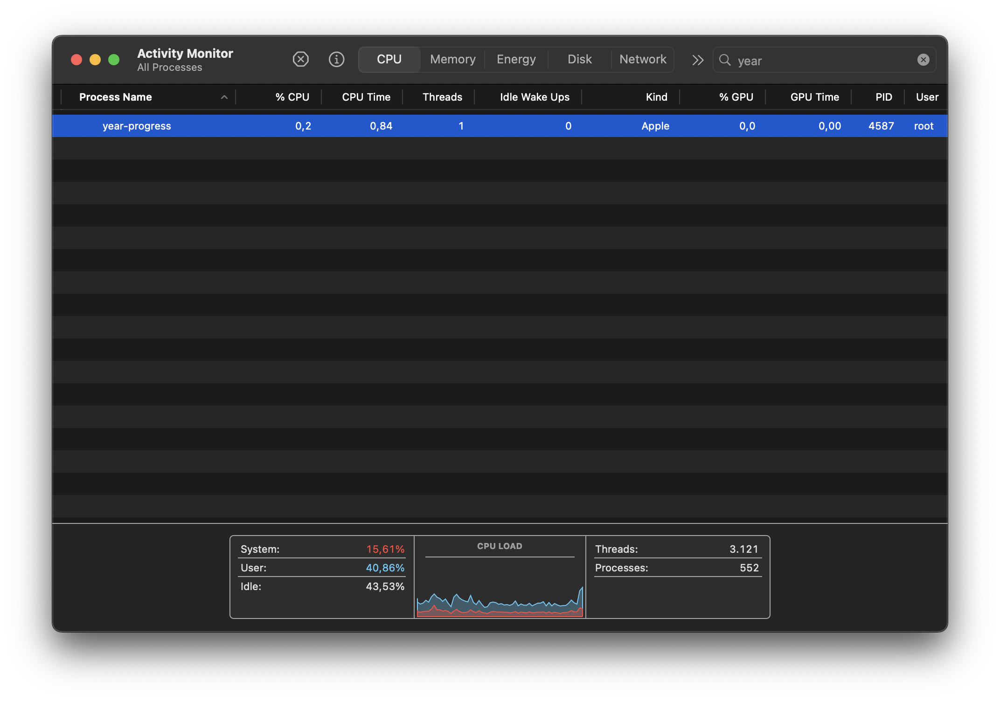

# Year Progress Wallpaper

Constantly remind yourself that time flies with a real-time year progress percentage wallpaper for your mac.


## About

Keep track of your year with an autogenerated wallpaper that shows how much of the year has gone by (as a percentage). Built with Rust because we like things nice and efficient.

## Performance

The application is designed to be extremely lightweight, with minimal image processing.

Here's the script running on an M1 SoC - on average the CPU % sits at 0,3%, with better performance on newer chips.



## How It Works

- Updates once per second
- Generates small TIFF images for performance
- Uses LaunchAgent for automatic startup
- Mac-only (uses osascript for wallpaper setting)

## Todo

- [ ] Add proper autostart configuration
- [ ] Auto-set wallpaper position to center with black background
- [ ] Configuration options for font and colors
- [ ] Configuration options for refresh speed (every second vs every 2 seconds) and % precision

## Requirements

- macOS (tested on Ventura and newer)
- Rust toolchain (cargo)
- Administrative privileges (for LaunchAgent setup)

## Installation

See `install.sh` for the installation process. Requires sudo privileges to set up the LaunchAgent.

Run the install script with:

```sh
sudo ./install.sh
```

## Contributing

Contributions welcome! Please ensure you test performance impact of any changes.